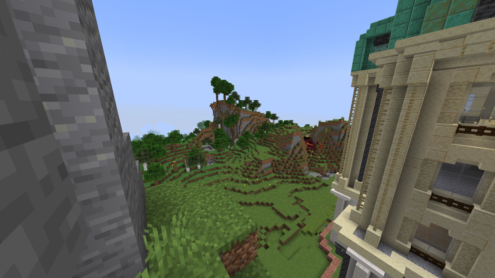
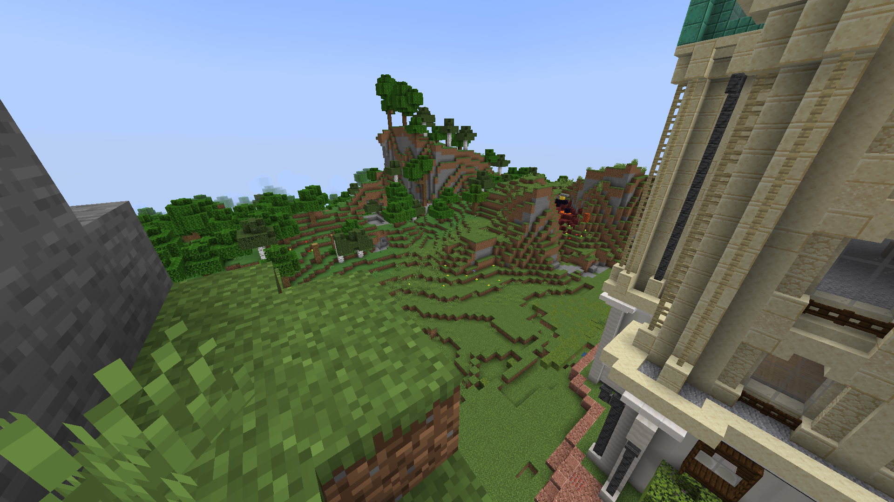

# GrainFixer (Fabric 1.21)

GrainFixer is a mod, that only allows textures with dimensions of power of two to load. Other textures are skipped to enable mipmapping.

Created as a workaround for playing on servers that has invalid textures in resourcepacks.

## Screenshots
Before:

After:
